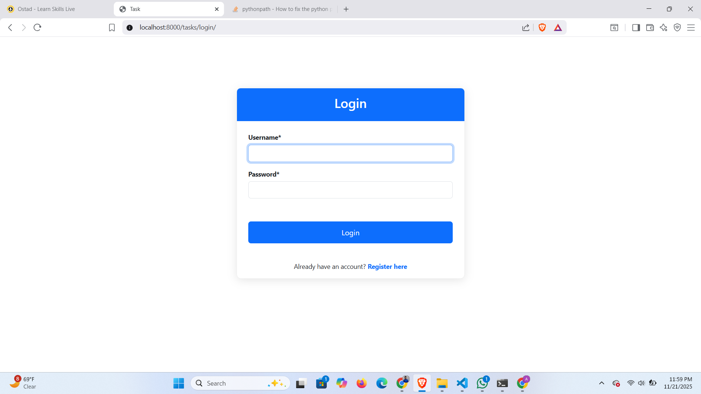
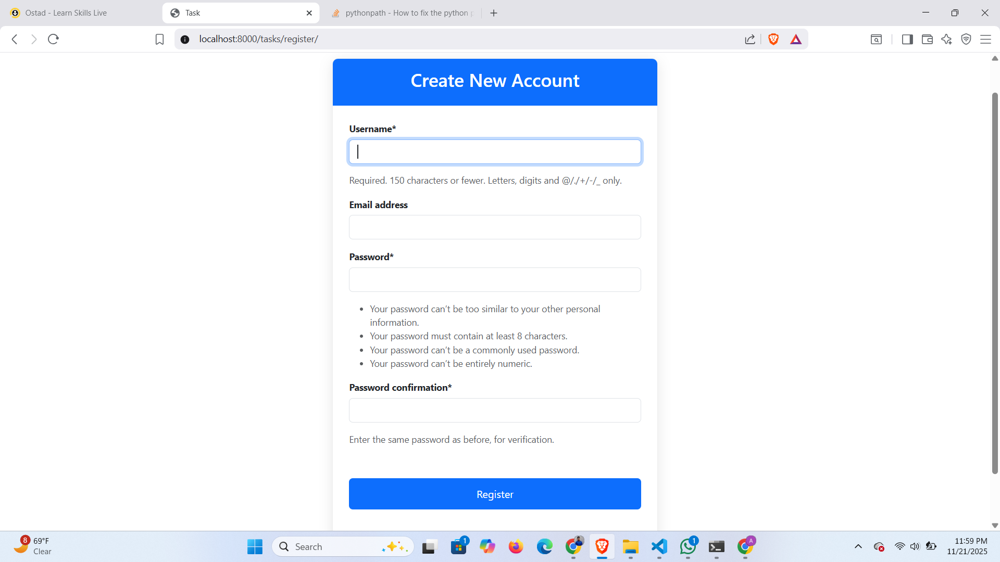
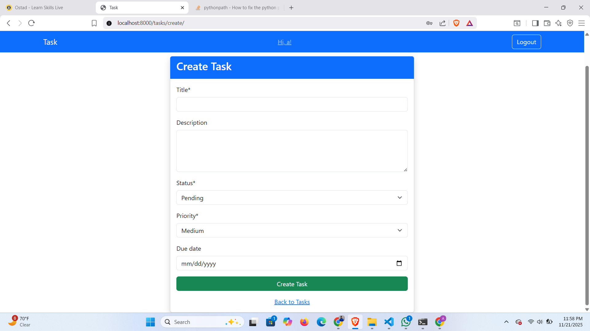
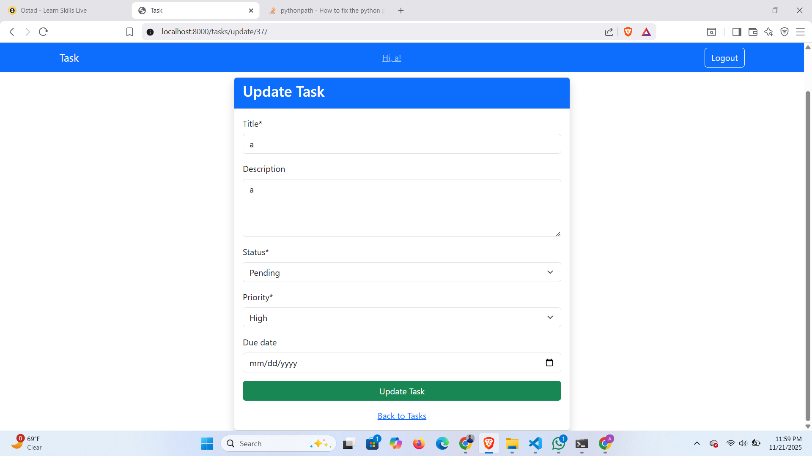
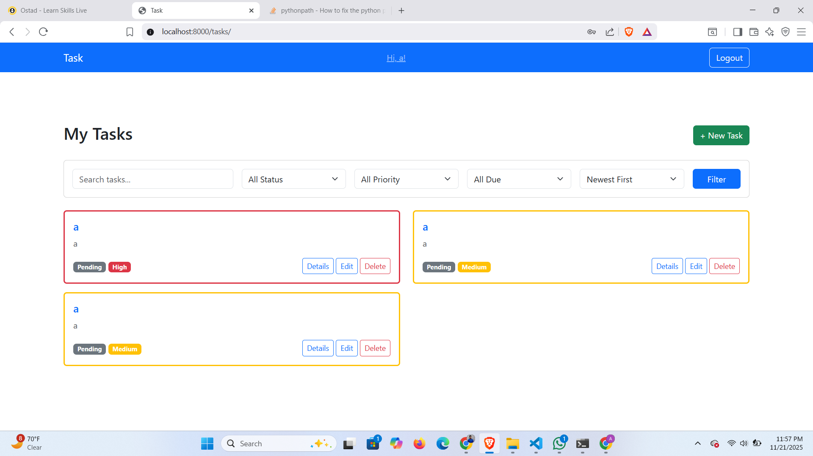
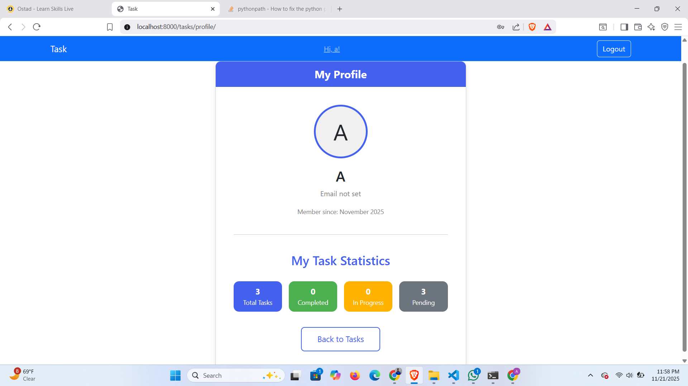
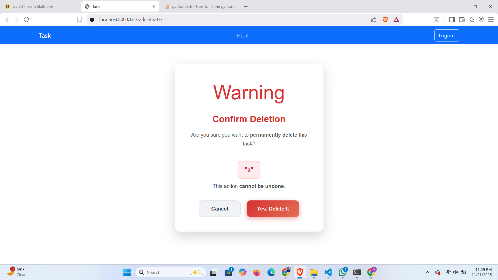

1. Clone the repository
   git clone (repository link)
   cd taskmanager

2. Create & activate virtual environment (optional)
   python -m venv venv
   venv\Scripts\activate

3. Install required packages
   pip install -r requirements.txt

4. Run migrations
   python manage.py migrate

5. Create superuser
   python manage.py createsuperuser

6. Start the server
   python manage.py runserver

Visit the app:
http://127.0.0.1:8000/

All screenshots are:

### Login Page

### Register

### Create Task

### update Task

### Task list

### Task details

### user profile

### Delete confirmation

